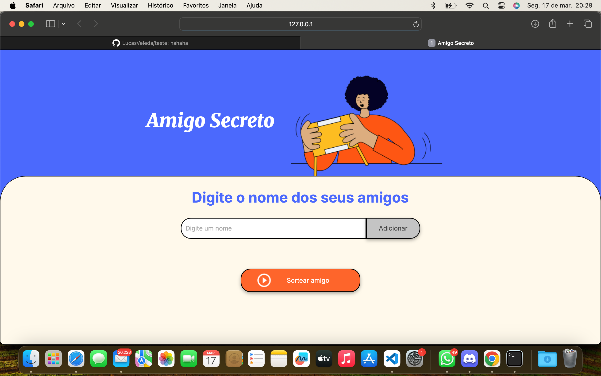
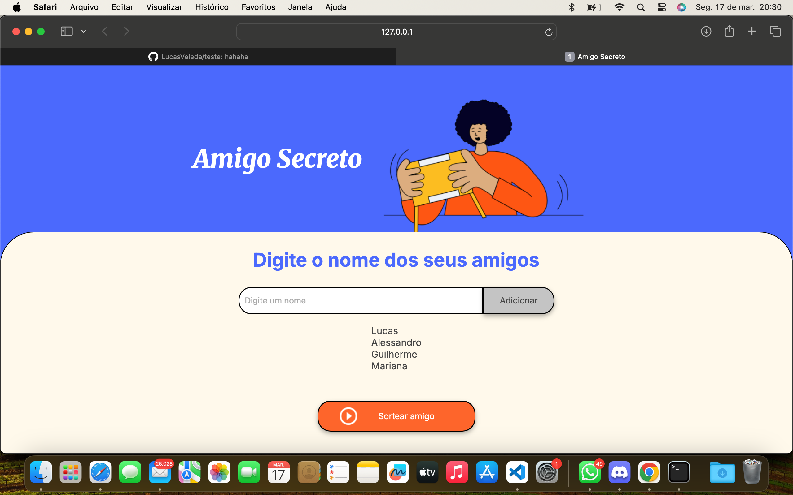
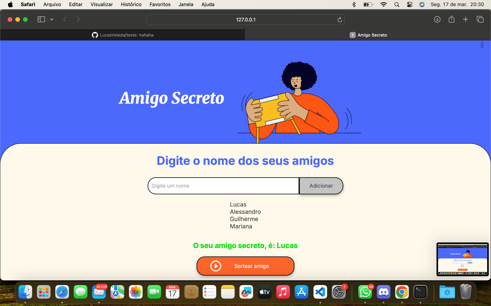

# Sorteio do Amigo Secreto

O projeto realiza  sorteio de amigo secreto. Os participantes são adicionados em uma lista e após basta clicar em realizar sorteio.

# Descrição do Projeto

O Objetivo do projeto é auxiliar na realização e organização de sorteio de amigo secreto.

# Funcionalidades

- Adicionar participantes.
- Realizar sorteio.
- Exibir os resultados.

# Tecnologias Utilizadas

 

# Paginas do Projeto

# Como Acessar o Projeto

1. Visite o site: https://amigo-secreto-eight-flame.vercel.app

2. É possível através do git clonar acessar o repositório pelo link: (https://github.com/LucasVeleda/amigo-secreto)